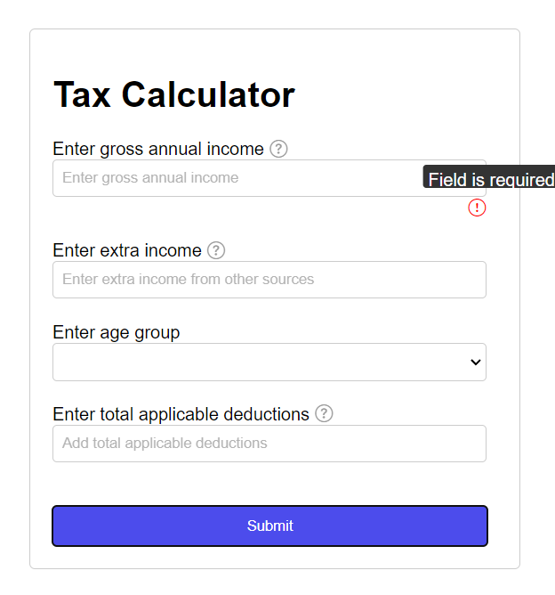
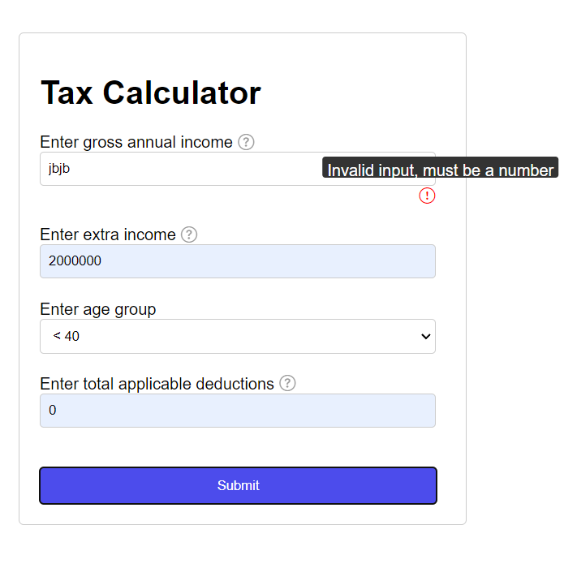
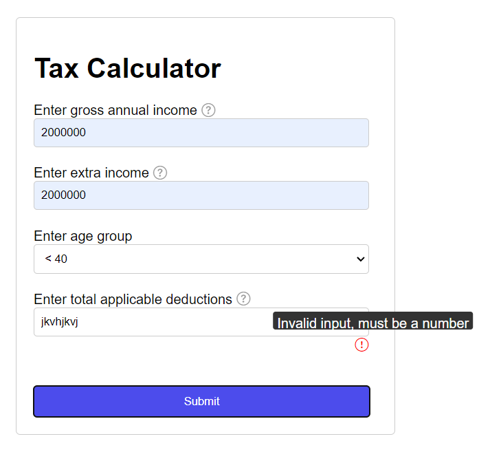
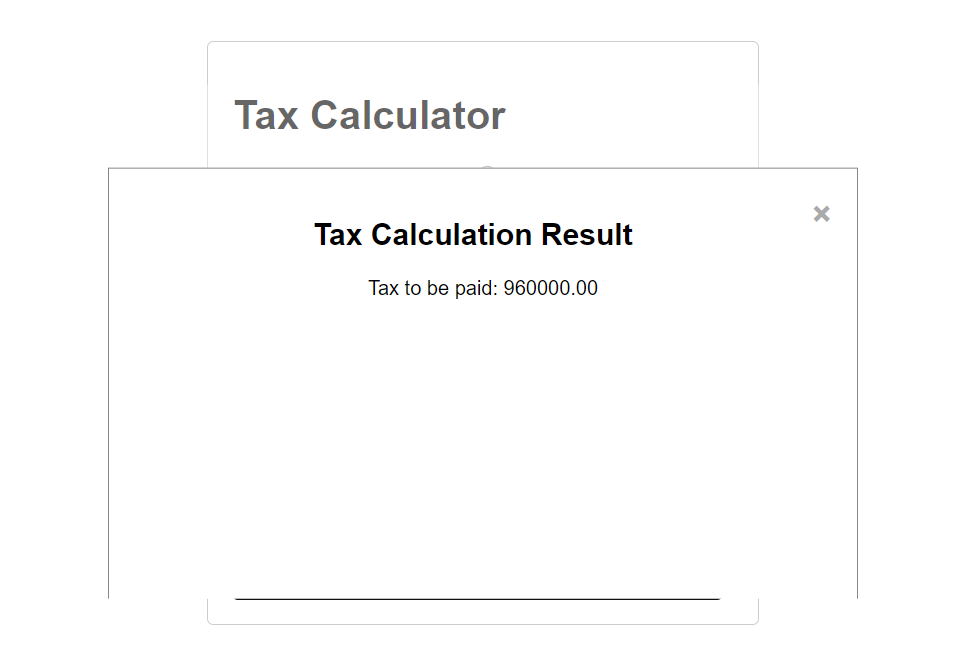
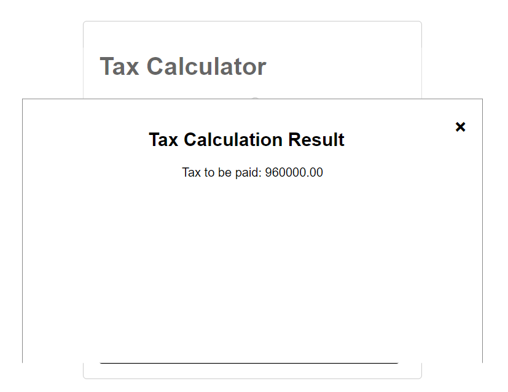

# Tax Calculator Web Application

This is a simple web application for calculating taxes based on gross annual income, extra income, age group, and applicable deductions.

## Features

- Calculate taxes based on gross annual income, extra income, age group, and applicable deductions.
- Clear validation and error messages for input fields.
- Modal popup to display tax calculation results.
- Responsive design for optimal viewing on various devices.

## File Structure

- `index.html`: Main HTML file containing the structure of the web page.
- `styles.css`: CSS file for styling the application.
- `script.js`: JavaScript file containing the application logic.
- `README.md`: Documentation file providing information about the project.

## Screenshot of  the App in Action

)




)



  
## Author

- [Shivam Saurabh](https://github.com/shivamsaurabh76)

## How to Run Locally

To run this project locally, follow these steps:

1. Clone this repository to your local machine:
```bash
git clone https://github.com/yourusername/Tax-Calculator.git

2. Navigate to the project directory:
```bash
cd Tax-Calculator

3. Open the index.html file in your preferred web browser.

4. Fill out the form fields with your gross annual income, extra income, age group, and applicable deductions.

5. Click the "Submit" button to calculate the tax.
